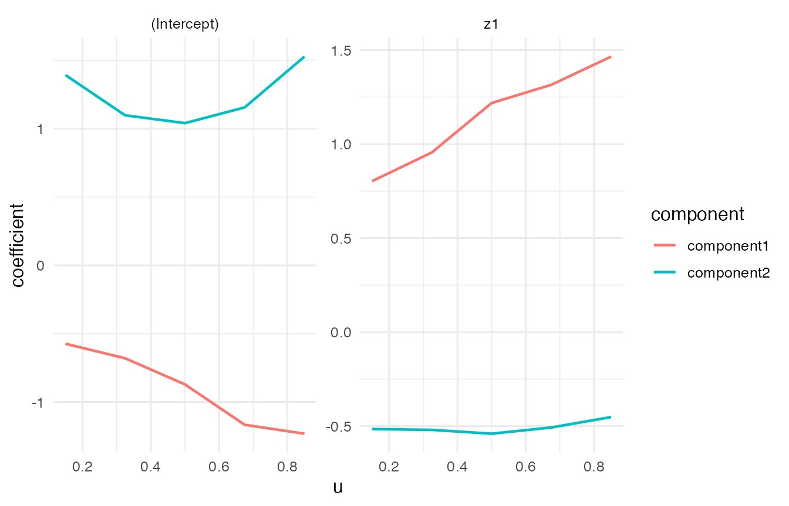
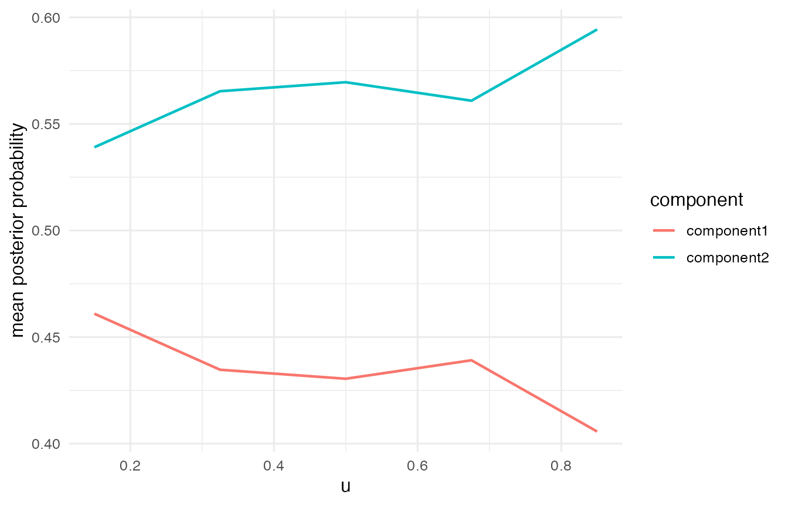

<div id="main" class="col-md-9" role="main">

# Binomial VCMoE Tutorial

This tutorial shows the Binomial family in `VCMoE`. Expert coefficients
are on the logit success-probability scale, and `predict(type = "mean")`
returns the marginal success probability.

The worked example uses grouped Binomial data because the repeated
trials make the latent components visually clearer than a very small
Bernoulli example. Bernoulli data use the same syntax with a 0/1
response column.

<div id="cb1" class="sourceCode">

``` r
library(VCMoE)
```

</div>

<div class="section level2">

## Simulate grouped Binomial data

<div id="cb2" class="sourceCode">

``` r
set.seed(52)

sim <- simulate_vcmoe_binomial(
  n = 300,
  k = 2,
  seed = 52,
  trials = 30,
  separation = 2.5,
  scenario = "well_separated"
)

head(sim$data)
#>   success failure trials          u         z1         x1 component
#> 1       4      26     30 0.00796557 -1.7061833 -0.3634315         1
#> 2      25       5     30 0.01386884  0.4538073 -2.7805432         2
#> 3      23       7     30 0.01645913 -0.2629754  0.7119834         2
#> 4       4      26     30 0.01921534 -1.1226504 -0.8331669         1
#> 5      26       4     30 0.02078965  1.1584983  0.6500925         2
#> 6      16      14     30 0.03155497  1.0336287  1.2031339         1
summary(sim$data$success / sim$data$trials)
#>    Min. 1st Qu.  Median    Mean 3rd Qu.    Max. 
#>  0.0000  0.3000  0.6667  0.5706  0.8000  1.0000
```

</div>

Grouped Binomial responses use the standard R two-column response form:
`cbind(success, failure)`.

<div id="cb3" class="sourceCode">

``` r
fit <- vcmoe_fit(
  cbind(success, failure) ~ z1 | x1,
  data = sim$data,
  u = "u",
  family = "binomial",
  k = 2,
  bandwidth = 0.50,
  u_grid = seq(0.15, 0.85, length.out = 5),
  control = list(maxit = 100, n_starts = 2, seed = 53, warn_ambiguous = FALSE)
)

fit
#> VCMoE fit
#>   family: binomial
#>   components: 2
#>   label alignment: global
#>   kernel: epanechnikov (density_over_bandwidth)
#>   local basis: (u - u0) / bandwidth
#>   u scale: unit
#>   grid points: 5
#>   bandwidth: 0.5
#>   converged grid points: 5/5
```

</div>

</div>

<div class="section level2">

## Coefficients and predictions

<div id="cb4" class="sourceCode">

``` r
coef(fit, "expert")[, , "z1"]
#>        component
#> u       component1 component2
#>   0.15   0.8029945 -0.5155188
#>   0.325  0.9555815 -0.5198394
#>   0.5    1.2186311 -0.5401502
#>   0.675  1.3156178 -0.5069988
#>   0.85   1.4655065 -0.4516495
```

</div>

Component-specific predictions are success probabilities, and the
marginal mean is the component-probability-weighted success probability.

<div id="cb5" class="sourceCode">

``` r
head(predict(fit, type = "component"))
#>      component1 component2
#> [1,]  0.1253160  0.9065391
#> [2,]  0.4480473  0.7610736
#> [3,]  0.3134292  0.8217266
#> [4,]  0.1862671  0.8777473
#> [5,]  0.5883866  0.6889668
#> [6,]  0.5639060  0.7025908
head(predict(fit, type = "mean"))
#> [1] 0.6632357 0.6858761 0.6455608 0.6725732 0.6543162 0.6522158
head(predict(fit, type = "posterior"))
#>              [,1]         [,2]
#> [1,] 1.000000e+00 3.391119e-22
#> [2,] 3.677410e-05 9.999632e-01
#> [3,] 1.571375e-06 9.999984e-01
#> [4,] 1.000000e+00 4.612266e-19
#> [5,] 2.594310e-02 9.740569e-01
#> [6,] 7.822688e-01 2.177312e-01
```

</div>

The posterior probabilities are intentionally sharp in this tutorial
example, so the component assignment is easy to see.

<div id="cb6" class="sourceCode">

``` r
post <- predict(fit, type = "posterior")
mean(apply(post, 1, max))
#> [1] 0.9377094
```

</div>

</div>

<div class="section level2">

## Diagnostics and plots

<div id="cb7" class="sourceCode">

``` r
diagnostics <- vcmoe_diagnostics(fit)
diagnostics[, c("u", "converged", "ambiguous", "posterior_entropy", "effective_n")]
#>       u converged ambiguous posterior_entropy effective_n
#> 1 0.150      TRUE     FALSE         0.1259956    160.3468
#> 2 0.325      TRUE     FALSE         0.1292298    212.7115
#> 3 0.500      TRUE     FALSE         0.1384023    248.7369
#> 4 0.675      TRUE     FALSE         0.1185062    224.5590
#> 5 0.850      TRUE     FALSE         0.1008948    176.0281
```

</div>

<div id="cb8" class="sourceCode">

``` r
plot_coefficients(fit, "expert")
```

</div>



<div id="cb9" class="sourceCode">

``` r
plot_posterior(fit)
```

</div>



</div>

<div class="section level2">

## Bernoulli response format

For Bernoulli data, use a single 0/1 response column:

<div id="cb10" class="sourceCode">

``` r
bern <- simulate_vcmoe_binomial(n = 300, k = 2, trials = 1)

bern_fit <- vcmoe_fit(
  y ~ z1 | x1,
  data = bern$data,
  u = "u",
  family = "binomial",
  k = 2,
  bandwidth = 0.50
)
```

</div>

The Bernoulli model has the same interpretation, but the grouped example
above is cleaner for a short tutorial because each observation carries
more Binomial information.

</div>

</div>
