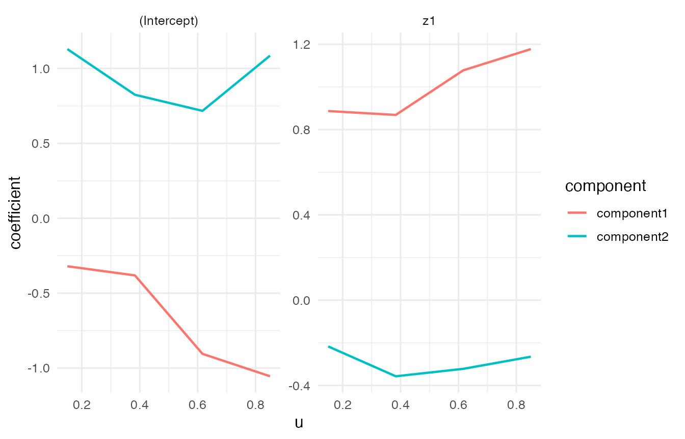
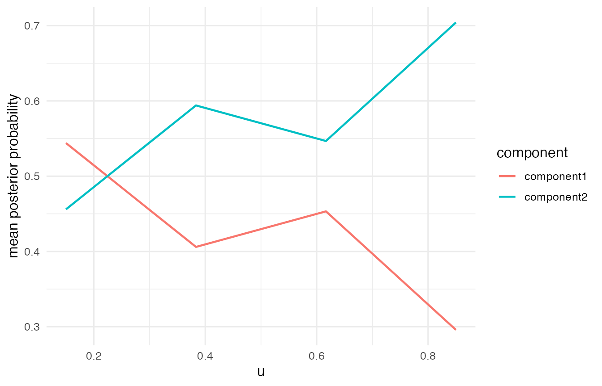
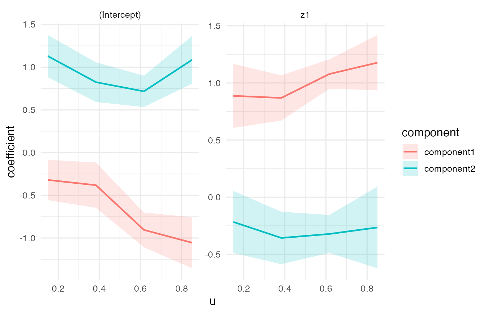
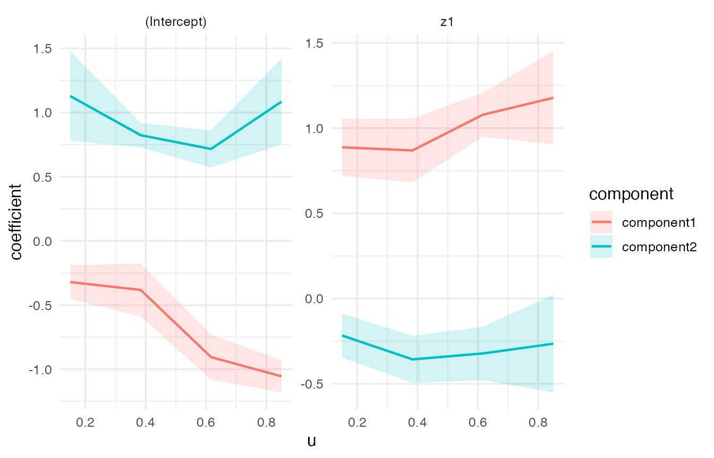

<div id="main" class="col-md-9" role="main">

# Gaussian VCMoE Tutorial

This tutorial gives a compact Gaussian workflow for using `VCMoE`:
simulation, fitting, diagnostics, coefficient plots, analytic
simultaneous confidence bands, and bootstrap inference.

<div class="section level2">

## Installation from GitHub

Install the package from GitHub with `remotes`:

<div id="cb1" class="sourceCode">

``` r
install.packages("remotes")
remotes::install_github("qc-zhao/VCMoE")
```

</div>

Then load the package:

<div id="cb2" class="sourceCode">

``` r
library(VCMoE)
library(ggplot2)
```

</div>

</div>

<div class="section level2">

## Gaussian model

Simulate a small Gaussian data set with two latent components. The
returned object contains the observed data and the true coefficient
functions.

<div id="cb3" class="sourceCode">

``` r
set.seed(1)

sim <- simulate_vcmoe_gaussian(
  n = 180,
  k = 2,
  seed = 1,
  separation = 1.6,
  scenario = "well_separated"
)

head(sim$data)
#>             y          u         z1         x1 component
#> 1 -1.20538651 0.01307758 -0.5425200 -0.2589326         1
#> 2  0.32147312 0.01339033  1.2078678  0.3943792         1
#> 3  1.16723844 0.02333120  1.1604026 -0.8518571         2
#> 4 -0.06870166 0.03554058  0.7002136  2.6491669         1
#> 5  1.36919490 0.05893438  1.5868335  0.1560117         2
#> 6  1.06597098 0.06178627  0.5584864  1.1302073         2
```

</div>

The model formula has two parts:

-   `y ~ z1` is the component-specific expert mean model;
-   `| x1` is the gating model for component probabilities.

The varying coordinate is supplied through `u = "u"`.

<div id="cb4" class="sourceCode">

``` r
fit <- vcmoe_fit(
  y ~ z1 | x1,
  data = sim$data,
  u = "u",
  family = "gaussian",
  k = 2,
  bandwidth = 0.35,
  u_grid = seq(0.15, 0.85, length.out = 4),
  control = list(maxit = 60, n_starts = 1, seed = 2, warn_ambiguous = FALSE)
)

fit
#> VCMoE fit
#>   family: gaussian
#>   components: 2
#>   label alignment: global
#>   kernel: epanechnikov (density_over_bandwidth)
#>   local basis: (u - u0) / bandwidth
#>   u scale: unit
#>   grid points: 4
#>   bandwidth: 0.35
#>   converged grid points: 4/4
```

</div>

Expert coefficients are returned as an array indexed by grid point,
component, and term.

<div id="cb5" class="sourceCode">

``` r
expert_coef <- coef(fit, "expert")
dim(expert_coef)
#> [1] 4 2 2
expert_coef[, , "z1"]
#>             component
#> u            component1 component2
#>   0.15        0.8870411 -0.2168521
#>   0.38333333  0.8687925 -0.3567810
#>   0.61666667  1.0780929 -0.3219224
#>   0.85        1.1775523 -0.2650091
```

</div>

Predictions can be requested as marginal means, posterior component
probabilities, or component-specific means.

<div id="cb6" class="sourceCode">

``` r
head(predict(fit, type = "mean"))
#> [1] -0.8016788  0.8411863  0.8640268  0.3781018  0.9534998  1.0079850
head(predict(fit, type = "posterior"))
#>              [,1]         [,2]
#> [1,] 9.999993e-01 6.984643e-07
#> [2,] 2.238460e-01 7.761540e-01
#> [3,] 7.986774e-02 9.201323e-01
#> [4,] 8.855677e-01 1.144323e-01
#> [5,] 5.576500e-01 4.423500e-01
#> [6,] 4.229101e-05 9.999577e-01
head(predict(fit, type = "component"))
#>      component1 component2
#> [1,] -0.8016802  1.2467758
#> [2,]  0.7509857  0.8672005
#> [3,]  0.7088822  0.8774934
#> [4,]  0.3006756  0.9772863
#> [5,]  1.0871439  0.7850209
#> [6,]  0.1749578  1.0080202
```

</div>

</div>

<div class="section level2">

## Diagnostics and basic plots

Always inspect diagnostics before interpreting coefficient functions.

<div id="cb7" class="sourceCode">

``` r
diagnostics <- vcmoe_diagnostics(fit)
diagnostics[, c("u", "converged", "ambiguous", "posterior_entropy", "effective_n")]
#>           u converged ambiguous posterior_entropy effective_n
#> 1 0.1500000      TRUE     FALSE         0.2020886    75.40914
#> 2 0.3833333      TRUE     FALSE         0.2306336   109.36806
#> 3 0.6166667      TRUE     FALSE         0.1654692   115.15966
#> 4 0.8500000      TRUE     FALSE         0.1324949    79.45137
```

</div>

`plot_coefficients()` and `plot_posterior()` provide quick visual
checks.

<div id="cb8" class="sourceCode">

``` r
plot_coefficients(fit, "expert")
```

</div>



<div id="cb9" class="sourceCode">

``` r
plot_posterior(fit)
```

</div>



</div>

<div class="section level2">

## Analytic simultaneous confidence bands

`vcmoe_confband()` computes diagnostic-gated analytic-style Epanechnikov
path bands. The returned object contains an interval table and
grid-level diagnostics. Rows with `status != "ok"` are blocked because
the local fit is too weak for the interval to be interpreted.

<div id="cb10" class="sourceCode">

``` r
band <- vcmoe_confband(
  fit,
  data = sim$data,
  level = 0.95,
  type = "simultaneous",
  coefficient_set = "expert",
  strict = FALSE
)

band
#> VCMoE analytic-style confidence bands
#>   family: gaussian
#>   components: 2
#>   type: simultaneous
#>   level: 0.95
#>   interval rows ok: 32/32
head(band$intervals[, c(
  "u", "component", "term", "block", "estimate",
  "lower", "upper", "status", "block_reason"
)])
#>      u  component        term     block    estimate      lower       upper
#> 1 0.15 component1 (Intercept) intercept -0.32044265 -0.5560750 -0.08481032
#> 2 0.15 component1          z1 intercept  0.88704111  0.6068012  1.16728101
#> 3 0.15 component2 (Intercept) intercept  1.12912917  0.8819065  1.37635179
#> 4 0.15 component2          z1 intercept -0.21685213 -0.4883527  0.05464840
#> 5 0.15 component1 (Intercept)     slope  0.94748432  0.3255871  1.56938155
#> 6 0.15 component1          z1     slope  0.07598394 -0.5013185  0.65328636
#>   status block_reason
#> 1     ok         <NA>
#> 2     ok         <NA>
#> 3     ok         <NA>
#> 4     ok         <NA>
#> 5     ok         <NA>
#> 6     ok         <NA>
```

</div>

For coefficient-function plots, use the local-linear intercept rows. The
slope rows describe local derivative terms and are not the coefficient
functions themselves.

<div id="cb11" class="sourceCode">

``` r
scb_plot <- subset(
  band$intervals,
  coefficient_set == "expert" & block == "intercept" & status == "ok"
)

ggplot(scb_plot, aes(x = u, y = estimate, color = component, fill = component)) +
  geom_ribbon(aes(ymin = lower, ymax = upper), alpha = 0.18, color = NA) +
  geom_line(linewidth = 0.8) +
  facet_wrap(~ term, scales = "free_y") +
  labs(
    x = "u",
    y = "coefficient",
    color = "component",
    fill = "component"
  ) +
  theme_minimal(base_size = 12)
```

</div>



</div>

<div class="section level2">

## Bootstrap inference

Parametric bootstrap inference is also available. Each bootstrap
replicate simulates a new response from the fitted mixture, refits the
same VCMoE model, and aligns bootstrap component labels back to the
reference fit.

<div id="cb12" class="sourceCode">

``` r
boot <- vcmoe_bootstrap(
  fit,
  data = sim$data,
  B = 6,
  seed = 5,
  min_successful = 2,
  control = list(maxit = 40, n_starts = 1, warn_ambiguous = FALSE)
)

boot
#> VCMoE bootstrap inference
#>   family: gaussian
#>   components: 2
#>   bootstrap replicates: 6/6 successful
#>   coefficient sets: expert, gating
head(confint(boot, parm = "expert", type = "simultaneous"))
#>   coefficient_set        term  component         u   estimate         se
#> 1          expert (Intercept) component1 0.1500000 -0.3204427 0.04760265
#> 2          expert (Intercept) component1 0.3833333 -0.3813966 0.07480567
#> 3          expert (Intercept) component1 0.6166667 -0.9050922 0.06340877
#> 4          expert (Intercept) component1 0.8500000 -1.0547571 0.04586277
#> 5          expert (Intercept) component2 0.1500000  1.1291292 0.09950992
#> 6          expert (Intercept) component2 0.3833333  0.8243641 0.02707169
#>        lower      upper         type level n_successful
#> 1 -0.4517064 -0.1891789 simultaneous  0.95            6
#> 2 -0.5876723 -0.1751209 simultaneous  0.95            6
#> 3 -1.0799411 -0.7302433 simultaneous  0.95            6
#> 4 -1.1812231 -0.9282911 simultaneous  0.95            6
#> 5  0.7797917  1.4784667 simultaneous  0.95            6
#> 6  0.7293268  0.9194014 simultaneous  0.95            6
```

</div>

`plot_inference()` visualizes bootstrap intervals directly. Here we
request simultaneous bootstrap bands for the coefficient paths.

<div id="cb13" class="sourceCode">

``` r
plot_inference(
  boot,
  coefficient_set = "expert",
  type = "simultaneous",
  level = 0.95
)
```

</div>



</div>

<div class="section level2">

## Optional bandwidth selection

For real analyses, bandwidth should usually be selected rather than
fixed by hand. The selector uses held-out predictive log-likelihood and
returns a final refit by default.

<div id="cb14" class="sourceCode">

``` r
selection <- vcmoe_select_bandwidth(
  y ~ z1 | x1,
  data = sim$data,
  u = "u",
  family = "gaussian",
  k = 2,
  bandwidth_grid = c(0.25, 0.35, 0.45),
  folds = 3,
  u_grid = seq(0.15, 0.85, length.out = 4),
  control = list(maxit = 60, n_starts = 1, seed = 3),
  seed = 4
)

selection
selection$best_bandwidth
```

</div>

</div>

</div>
