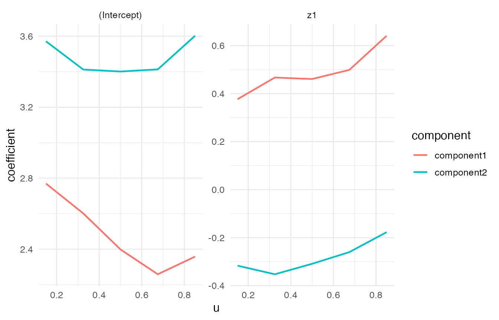
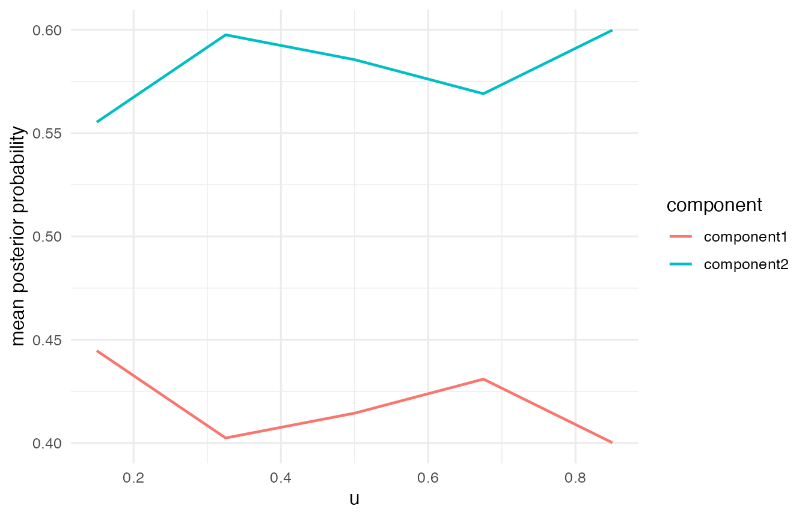

<div id="main" class="col-md-9" role="main">

# Negative-Binomial VCMoE Tutorial

This tutorial shows the Negative-Binomial family in `VCMoE`. Expert
coefficients are on the log mean count scale. Library size or size
factors should enter through an expert-side offset such as
`offset(log_size_factor)`.

<div id="cb1" class="sourceCode">

``` r
library(VCMoE)
```

</div>

<div class="section level2">

## Simulate count data

<div id="cb2" class="sourceCode">

``` r
set.seed(61)

sim <- simulate_vcmoe_negbin(
  n = 320,
  k = 2,
  seed = 61,
  separation = 3.0,
  mean_count = 18,
  scenario = "well_separated"
)

head(sim$data)
#>     y           u          z1          x1 size_factor log_size_factor component
#> 1  41 0.002060810  0.38763954 -0.99764329   0.5894359      -0.5285892         2
#> 2  64 0.006113068 -1.86003760 -0.77784040   1.2244753       0.2025124         2
#> 3  55 0.006241603 -0.61665820  0.86469706   1.2212583       0.1998818         2
#> 4  28 0.013615126  0.24613859  0.29382958   1.5135793       0.4144772         1
#> 5  28 0.016265503  0.01320161 -0.62373067   1.1703616       0.1573127         2
#> 6 109 0.016968450 -1.64503391  0.03270223   1.2195169       0.1984548         2
summary(sim$data$y)
#>    Min. 1st Qu.  Median    Mean 3rd Qu.    Max. 
#>    0.00   10.00   21.00   25.94   36.00  174.00
```

</div>

</div>

<div class="section level2">

## Fit the model

The offset is part of the expert formula, not a separate argument. It
controls library-size variation before interpreting the
component-specific coefficients.

<div id="cb3" class="sourceCode">

``` r
fit <- vcmoe_fit(
  y ~ z1 + offset(log_size_factor) | x1,
  data = sim$data,
  u = "u",
  family = "negative-binomial",
  k = 2,
  bandwidth = 0.60,
  u_grid = seq(0.15, 0.85, length.out = 5),
  control = list(
    maxit = 120,
    n_starts = 2,
    seed = 62,
    warn_ambiguous = FALSE,
    ridge = 1e-4,
    negbin_theta_ridge = 0.05,
    negbin_theta_target = 8
  )
)

fit
#> VCMoE fit
#>   family: negative-binomial
#>   components: 2
#>   label alignment: global
#>   kernel: epanechnikov (density_over_bandwidth)
#>   local basis: (u - u0) / bandwidth
#>   u scale: unit
#>   grid points: 5
#>   bandwidth: 0.6
#>   converged grid points: 5/5
```

</div>

</div>

<div class="section level2">

## Coefficients, dispersion, and predictions

<div id="cb4" class="sourceCode">

``` r
coef(fit, "expert")[, , "z1"]
#>        component
#> u       component1 component2
#>   0.15   0.3768727 -0.3166905
#>   0.325  0.4670305 -0.3525040
#>   0.5    0.4607991 -0.3089095
#>   0.675  0.4988736 -0.2601763
#>   0.85   0.6409380 -0.1771268
coef(fit, "theta")
#>        component
#> u       component1 component2
#>   0.15    9.273331   9.230572
#>   0.325   9.198954   6.852272
#>   0.5     8.495498   6.196824
#>   0.675   7.599301   6.045190
#>   0.85    5.619365   6.925477
```

</div>

Component-specific predictions and marginal means are on the count
scale.

<div id="cb5" class="sourceCode">

``` r
head(predict(fit, type = "component"))
#>      component1 component2
#> [1,]  10.880916   18.53663
#> [2,]   9.689315   78.46625
#> [3,]  15.440423   52.78735
#> [4,]  26.489515   49.78070
#> [5,]  18.761313   41.43939
#> [6,]  10.464569   73.00452
head(predict(fit, type = "mean"))
#> [1] 15.70626 52.70921 37.43566 40.50575 32.86985 48.46449
head(predict(fit, type = "posterior"))
#>              [,1]      [,2]
#> [1,] 2.033240e-03 0.9979668
#> [2,] 2.451254e-10 1.0000000
#> [3,] 1.524823e-04 0.9998475
#> [4,] 6.489808e-01 0.3510192
#> [5,] 3.558165e-01 0.6441835
#> [6,] 1.518762e-19 1.0000000
```

</div>

<div id="cb6" class="sourceCode">

``` r
post <- predict(fit, type = "posterior")
mean(apply(post, 1, max))
#> [1] 0.8453456
```

</div>

</div>

<div class="section level2">

## Diagnostics and plots

<div id="cb7" class="sourceCode">

``` r
diagnostics <- vcmoe_diagnostics(fit)
diagnostics[, c("u", "converged", "ambiguous", "posterior_entropy", "effective_n")]
#>           u converged ambiguous posterior_entropy effective_n
#> 0.15  0.150      TRUE     FALSE         0.3333433    202.3687
#> 0.325 0.325      TRUE     FALSE         0.3377879    255.9518
#> 0.5   0.500      TRUE     FALSE         0.3096477    297.3595
#> 0.675 0.675      TRUE     FALSE         0.2892309    261.0491
#> 0.85  0.850      TRUE     FALSE         0.2710507    204.5169
```

</div>

<div id="cb8" class="sourceCode">

``` r
plot_coefficients(fit, "expert")
```

</div>



<div id="cb9" class="sourceCode">

``` r
plot_posterior(fit)
```

</div>



</div>

</div>
